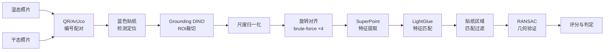
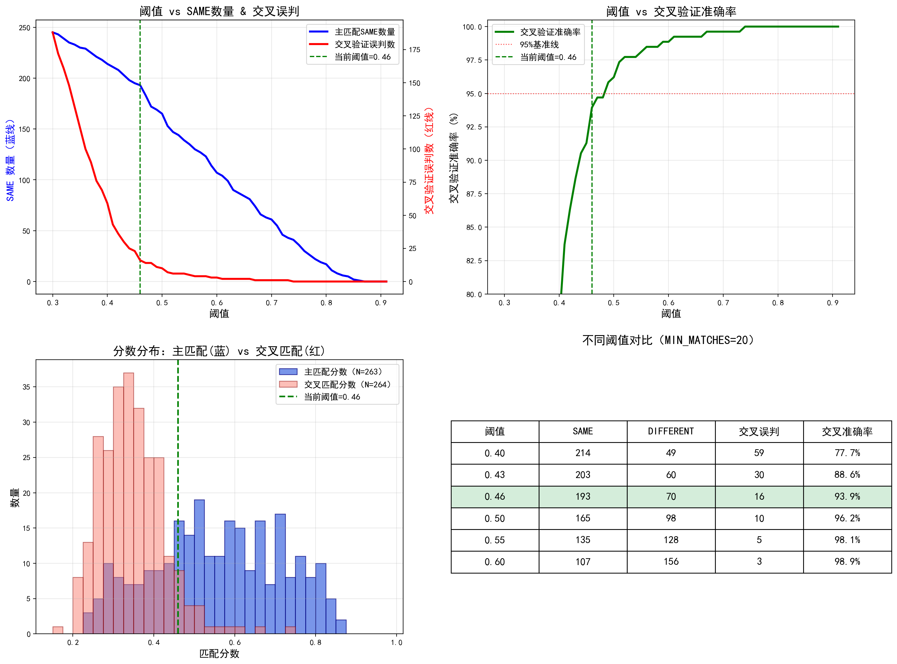

# 混凝土试块一致性检测系统 — 技术报告

> **Concrete Specimen Consistency Verification via Local Feature Matching**

---

## 1. 背景与问题定义

### 1.1 行业背景

混凝土试块（test cube / test block）是评估混凝土强度的关键质控手段。按规范要求，施工现场浇筑混凝土时应同步制作标准试块（通常为 150mm 立方体），经标准养护后送检测机构进行抗压强度试验。试块的检测结果直接关系到工程结构的安全评定。

### 1.2 问题描述

实际操作中存在"掉包"风险：部分供应商可能在制作后、送检前将低强度试块替换为高强度试块，以通过检测。现有监管方式主要依赖人工比对制作时（湿态）与送检时（干态）的照片，效率低且主观性强。

**核心任务**：给定同一编号试块的两张照片——制作时的湿态照片和送检时的干态照片——自动判断两张照片中是否为同一个试块。

系统对每组图片对输出以下四种判定结果之一：**SAME**（一致，判定为同一试块）、**DIFFERENT**（疑似替换）、**INSUFFICIENT**（特征证据不足，无法判定）或 **INVALID**（照片缺少关键标识，无法处理）。各判定的详细定义与触发条件见第 2.12 节。

### 1.3 技术挑战

该任务面临多重困难，使其不同于一般的图像匹配问题：

1. **跨状态匹配**：湿态与干态的混凝土表面在颜色、反光特性上存在显著差异（湿态偏深、有水光反射；干态偏灰白、表面粗糙），属于跨模态匹配问题
2. **同批高相似性**：同一批次的不同试块由相同配合比浇筑，宏观纹理高度相似，仅凭整体外观难以区分
3. **拍摄条件不可控**：现场拍摄的角度、光照、背景、距离均不一致，且无标准化采集流程
4. **旋转与尺度变化**：干态送检时试块可能被翻转、旋转，与制作时的朝向不同
5. **干扰元素**：模具边框、相邻试块、标签、手写文字等背景元素可能影响特征提取

### 1.4 数据概况

本次实验数据来自 6 家混凝土供应商：

| 供应商 | 批次数 | 图片对数 |
|--------|--------|----------|
| 宁波大目湾商品混凝土有限公司 | 18 | 54 |
| 宁波象保合作区航建混凝土有限公司 | 17 | 51 |
| 日升集团象山昌业商砼技术有限公司 | 18 | 54 |
| 象山县美科新型墙体材料有限公司 | 17 | 51 |
| 象山港浦新型建筑材料有限公司 | 18 | 54 |
| 象山甬港混凝土有限公司 | 2 | 6 |
| **合计** | **90** | **270** |

每个批次包含 3 组试块，每组 1 张湿态照片 + 1 张干态照片。图片通过现场人员手机拍摄，分辨率、角度、光照条件各异。每张照片上贴有蓝色圆形标签及二维码/ArUco 码用于编号识别。这些编号由送检机构统一分配并粘贴在试块表面，用于在制作和送检两个环节中追踪同一试块的身份——系统正是依据这些编号将同一试块的湿态照片和干态照片进行配对。

---

## 2. 方法

### 2.1 系统总览

本系统采用基于**局部特征匹配**（Local Feature Matching）的方法。所谓"局部特征匹配"，是指从图像中提取具有辨识度的局部点（如气孔边缘、砂粒凸起、微裂纹等），为每个点计算一组数值描述其周围纹理模式，然后在两张图之间寻找描述相似的点对——如果大量特征点能在两张图中找到空间位置一致的对应关系，就说明它们拍摄的是同一物体。

核心思路是：如果两张照片拍的是同一个试块，那么混凝土表面的微观纹理（气孔、砂粒分布、裂纹等）在空间位置上应保持一致；而不同试块即使宏观相似，微观纹理的空间分布也是不同的。

系统处理流程（pipeline）包含以下阶段：

上述流程最终产生四种判定结果，其含义如下：

| 判定结果 | 中文释义 | 触发条件 | 通俗解释 |
|----------|----------|----------|----------|
| **SAME** | 一致 | 综合评分 ≥ 0.46 | 两张照片中的混凝土表面纹理高度吻合，判定为同一试块，未发生替换 |
| **DIFFERENT** | 疑似替换 | 综合评分 < 0.46 | 纹理吻合程度不足，两张照片中的试块可能不是同一个，存在被掉包的嫌疑 |
| **INSUFFICIENT** | 证据不足 | 有效匹配点 < 4 | 能匹配到的有效特征点过少（可能由于图片模糊、遮挡等），系统无法做出可靠判定 |
| **INVALID** | 无法处理 | 贴纸或二维码缺失 | 照片上缺少蓝色圆形贴纸或编号二维码等关键标识，系统无法完成自动配对或区域定位 |

> 以下各节将逐步介绍流程中每一步的具体做法和原理。文中涉及的计算机视觉（CV）专业术语，在首次出现时均附有中文解释。

### 2.2 配对：QR 码识别

每张试块照片上的蓝色标签内含二维码，编码了该试块的唯一编号（如 `0111250003709-3`）。系统对每张图片解码 QR 内容，再按编号将同一试块的湿态和干态照片配对。

**QR 解码级联**（依次尝试，成功即停止）：

1. **OpenCV QRCodeDetector**：原图 + CLAHE 增强
2. **2× 放大后重试**：应对低分辨率或模糊二维码
3. **3× 放大 + 强增强**
4. **QRCodeDetectorAruco**：OpenCV 的 ArUco 增强版检测器，对变形二维码更鲁棒
5. **pyzbar 兜底**：第三方库作为最终备选

**配对逻辑**：解码成功后提取编号，按编号匹配同批次内的湿态/干态文件。如果 QR 解码彻底失败（所有级联均无法识别），则优先查询 **手动配对表**（`manual_pairs.json`）——操作员可通过 Web 端手动配对工具录入正确配对后保存至该文件。仍无法配对的图片标记为 **INVALID**。

### 2.3 蓝色贴纸检测

蓝色圆形贴纸是每张照片上的固定元素，承担两个关键作用：
- **定位参考**：贴纸位置帮助确定混凝土面的大致区域，辅助 ROI 裁切和验证
- **旋转参考**：贴纸在混凝土面上的相对位置（如"左上角"还是"右下角"）可帮助判断试块是否被旋转

检测流程（基于颜色和形状的组合策略）：
1. 将图像从 BGR 转换到 HSV 色彩空间（HSV 将颜色的色相、饱和度、明度分离，更适合基于颜色的检测）
2. 按蓝色范围（H: 90–130, S: 50–255, V: 50–255）创建掩码，筛选出图像中所有蓝色区域
3. 形态学操作（开运算去噪 + 闭运算填洞）
4. 轮廓检测，按面积筛选候选圆
5. 梯度精化：在候选区域沿径向采样梯度，优化圆心和半径估计

### 2.4 ROI 裁切：Grounding DINO

原始照片中混凝土面仅占画面的一部分，背景包含模具、地面、其他试块等干扰。如果直接对整张照片进行特征匹配，背景中的干扰元素会产生大量无意义的匹配点，严重影响判定准确性。因此，首先需要从照片中裁切出仅包含目标混凝土面的 **ROI（Region of Interest，感兴趣区域）**——即我们真正需要分析的图像区域。

本系统使用 **Grounding DINO** 进行零样本（zero-shot）ROI 检测。**Grounding DINO** 是一种**开放集目标检测模型**（Open-Set Object Detector，232M 参数），能够根据自然语言文本描述在图像中自动定位任意物体，而无需针对"混凝土试块"进行专门训练——我们只需用文字告诉模型"找到混凝土表面"，它就能自动框出对应区域。

对湿态和干态分别使用不同的文本提示（prompt），因为二者的拍摄场景不同：
- **湿态**：引导检测模具中的灰色混凝土表面（此时试块还在模具中）
- **干态**：引导检测独立的混凝土立方体表面（此时试块已脱模）

Grounding DINO 输出边界框后，按检测到的蓝色贴纸位置验证和筛选最佳框，裁切出只包含目标混凝土面的 ROI 区域。

### 2.5 尺度归一化

由于湿态和干态照片的拍摄距离不同，裁切后的 ROI 尺寸可能差异较大。特征匹配要求两张图像中的同一物理结构在像素尺度上大致相同，否则特征描述子会因尺度差异而不匹配。系统计算两幅 ROI 的面积比，当比值超过 1.5 时，将较大的图等比缩放至与较小图面积接近：

$$\text{scale} = \sqrt{\frac{A_{\text{target}}}{A_{\text{source}}}}$$

缩放采用 `INTER_AREA` 插值（缩小时）或 `INTER_LINEAR` 插值（放大时），保持宽高比不变。

> **其他预处理步骤**：除上述 ROI 裁切和尺度归一化外，系统还对图像进行以下增强处理：
>
> - **CLAHE（Contrast Limited Adaptive Histogram Equalization，对比度受限自适应直方图均衡化）**：一种图像增强技术，将图像分成若干小区域分别调整亮度分布，在不过度放大噪声的前提下提升局部对比度。处理后，混凝土表面的气孔、砂粒等微观纹理细节更加清晰，有利于后续特征点的检测和匹配。
> - **透视矫正（Perspective Rectification）**：由于拍摄角度不正，照片中的混凝土面可能呈现梯形等透视畸变，导致干湿两图的几何形状不一致。系统通过检测蓝色贴纸的椭圆形状，利用迭代单应性变换（Homography）将其校正为正圆——当贴纸被校正为正圆时，整个混凝土面也就基本恢复了正视视角，使干湿两图在几何上更加可比，提升匹配精度。

### 2.6 旋转对齐

干态试块可能相对于湿态被旋转了 0°、90°、180° 或 270°。这是因为试块在脱模、搬运、养护过程中可能被翻转或旋转放置，导致送检时的朝向与制作时不同。如果不进行旋转对齐，特征匹配会因为"同一气孔在两张图中位于不同位置"而失败。

系统采用 **brute-force 4 候选**策略（穷举搜索）：

对湿态图分别旋转 0°、90°、180°、270°，每个角度独立执行后续的特征提取和匹配流程，取最终得分最高的旋转角度作为最优对齐。

这种穷举方式虽然计算量增加至 4 倍，但避免了旋转预估的误差传播，保证了对齐的鲁棒性。

### 2.7 特征提取：SuperPoint

**SuperPoint** 是一种基于深度学习的**局部特征点检测与描述子提取网络**（local feature detector and descriptor）。通俗地说，它的作用是在图像中自动找到具有辨识度的"特征点"——如混凝土表面的气孔边缘、砂粒突起、微裂纹转角等可辨识的微观结构——并为每个特征点计算一组数值（称为"描述子"），用于描述该点周围的纹理模式。两张图片中描述子相似的特征点，就可能对应同一个物理位置。SuperPoint 采用自监督方式训练，相比传统的 SIFT/SURF 等手工设计的特征提取方法，在以下方面更适合本任务：

- **跨光照鲁棒性**：对光照变化的不变性更强，适应湿态与干态间的外观差异
- **重复性高**：在纹理丰富的表面（如混凝土）上能稳定检测相同位置的特征点
- **GPU 加速**：在 GPU 上运行速度快，适合批量处理

系统设置最大关键点数为 2048，在保持足够匹配候选的同时避免过多低质量特征点。

### 2.8 特征匹配：LightGlue

**LightGlue** 是一种基于深度学习的**特征匹配器**（feature matcher），是 SuperGlue 的轻量化改进版本。它的作用是接收上一步中从两张图各自提取的特征点及描述子，判断哪些特征点"对应同一个物理位置"——即在两张图中找到描述同一气孔、同一砂粒的配对关系。LightGlue 采用自适应的 Transformer 架构（一种基于注意力机制的神经网络）进行特征匹配。其核心优势：

- **自适应计算**：根据匹配难度动态调整推理深度，简单场景提前退出，节省计算时间
- **匹配置信度（confidence）**：输出每对匹配的置信度分数（取值范围 0 到 1），数值越高表示模型越确信这两个特征点确实对应同一物理位置。置信度综合反映了特征描述子的相似程度和匹配的唯一性
- **端到端训练**：联合学习特征匹配与异常值抑制，减少错误匹配

LightGlue 输出匹配索引矩阵和对应的置信度分数，前者标识哪些特征点相互对应，后者量化每对匹配的可靠程度。

### 2.9 贴纸区域匹配过滤

由于所有试块使用同款蓝色贴纸，贴纸区域会产生大量高置信度但无意义的匹配——不同试块的贴纸看起来完全相同，因此贴纸上的特征点总能匹配成功（贴纸对贴纸），但这并不能说明是同一试块。如果不排除这些匹配，会导致不同试块的分数虚高，增加误判风险。

系统通过贴纸检测生成的掩码，排除落在贴纸区域内的匹配点：

- 对两图分别计算以贴纸中心为圆心、贴纸半径 ×1.2 为半径的掩码
- 任一端落在掩码内的匹配对被剔除
- 仅保留混凝土表面上的有效匹配

### 2.10 RANSAC 几何验证

特征匹配器输出的匹配中不可避免包含错误匹配（outlier，外点）——即将两张图中实际不对应的特征点误认为对应。**RANSAC**（Random Sample Consensus，随机采样一致性算法）是一种经典的鲁棒估计方法，专门用于从含有大量异常值的数据中筛选出可靠的"内点"。其基本思想是：如果两张图确实拍的是同一个试块，那么正确的匹配点之间应该满足一个统一的几何变换关系（例如旋转+平移+缩放）。RANSAC 通过以下步骤过滤错误匹配：

1. 从匹配点中随机采样最少 3 组点对
2. 估计一个仿射变换矩阵 $\mathbf{H}$（包含旋转、缩放、平移）
3. 用 $\mathbf{H}$ 将所有源端匹配点变换到目标图坐标系
4. 统计变换后与目标端匹配点距离在阈值内（reprojection error < 3px）的点数
5. 迭代多次，取内点最多的变换模型

最终匹配被分为：
- **内点（Inlier）**：符合全局几何变换，空间位置关系一致
- **外点（Outlier）**：与整体变换矛盾，属于错误匹配

**内点比例**（inlier_ratio = 内点数 / 总匹配数）直接反映匹配的几何可靠性。内点比例越高，说明匹配点之间的空间位置关系越一致——这是判断"是否为同一物体"的关键指标，因为同一试块的不同照片中，特征点的相对位置关系应当保持不变；而不同试块之间，即使偶然匹配上了一些外观相似的点，这些点的空间位置关系也不会满足统一的几何变换。

### 2.11 评分公式

综合匹配置信度（特征外观的相似程度）与几何一致性（空间位置关系的吻合程度），计算最终分数：

$$\text{final\_score} = \underbrace{(w_c \times \bar{C} + w_r \times R)}_{\text{质量分}} \times \underbrace{\min\left(1,\ \frac{n}{N_{\min}}\right)}_{\text{充分性惩罚}}$$

其中各变量定义如下（分数越高表示越可能是同一试块）：

| 符号 | 含义 | 取值范围 |
|------|------|--------|
| $\bar{C}$ | **平均置信度**：所有有效匹配点的 LightGlue 置信度均值，反映特征外观的整体相似程度 | [0, 1] |
| $R$ | **内点比例**（inlier_ratio）：RANSAC 验证后内点占总匹配的比例，反映匹配点空间位置关系的一致程度 | [0, 1] |
| $w_c, w_r$ | **权重系数**：分别控制置信度和内点比例在最终分数中的占比 | 0.5, 0.5 |
| $n$ | **有效匹配数**：经贴纸区域过滤后剩余的匹配点数量 | 整数 |
| $N_{\min}$ | **最低匹配数阈值**：低于此值时分数将被线性惩罚（衰减） | 20 |

**公式设计思路**：

1. **双维度融合**：单纯的外观相似度（$\bar{C}$）不足以判断是否为同一物体——不同混凝土块可能有相似纹理而置信度偏高。加入内点比例 $R$ 要求匹配点在空间位置上也保持一致，将"看起来像"和"位置关系一致"两个独立维度等权融合。

2. **充分性惩罚**：当有效匹配点数 $n$ 不足 $N_{\min}$（20）时，以 $n/N_{\min}$ 线性衰减分数。这是因为少量匹配点的 RANSAC 内点率可能虚高（几个随机匹配碰巧通过仿射变换验证），缺乏统计可靠性。

3. **参数优化过程**：通过网格搜索（Grid Search，穷举所有参数组合）在以下参数空间中最大化 F1 score：
   - 权重 $w_c$: 0.0 – 1.0（步长 0.1）
   - $N_{\min}$: 3 – 30（步长 1）
   - 判定阈值: 0.30 – 0.80（步长 0.01）
   
   搜索使用 263 对主匹配（正样本）+ 264 对同批交叉配对（负样本），结果表明：
   - 权重在 0.3–0.7 范围内对 F1 影响 <1%，等权（0.5/0.5）即可
   - $N_{\min}$ 是最关键参数：从 15 提升到 20 后，交叉对中 51% 的匹配数不足 20，分数被有效压制
   - 最优判定阈值为 0.46，F1 = 0.794

### 2.12 判定标准

| 判定 | 条件 | 含义 |
|------|------|------|
| **SAME** | final_score ≥ 0.46 | 判定为同一试块 |
| **DIFFERENT** | final_score < 0.46 | 疑似替换 |
| **INSUFFICIENT** | 有效匹配数 < 4 | 匹配证据不足，无法判定 |
| **INVALID** | 无贴纸或无二维码 | 关键元素缺失，无法处理 |

**各判定结果的详细说明**：

- **SAME（一致）**：系统在两张照片的混凝土表面找到了足够多的、空间位置一致的匹配特征点，综合评分达到阈值（≥ 0.46），判定干态与湿态为同一试块。这表明该试块在制作后未被替换。
- **DIFFERENT（疑似替换）**：综合评分低于阈值（< 0.46），说明两张照片中的混凝土表面纹理吻合程度不足。可能的原因包括：①试块确实被替换了（掉包）；②拍摄质量差导致可提取的特征过少；③预处理中 ROI 裁切不准确。建议结合可视化匹配图人工复核。
- **INSUFFICIENT（证据不足）**：经过贴纸区域过滤后，剩余的有效匹配点不足 4 个。这通常是因为图片模糊、混凝土面被遮挡、或 ROI 裁切区域过小，导致系统无法提取足够的特征信息。此类结果既不表示一致也不表示替换，需要人工介入判断。
- **INVALID（无法处理）**：照片上未能检测到蓝色圆形贴纸或编号二维码/ArUco 码，系统无法完成自动配对（不知道哪两张图属于同一试块）或无法定位混凝土面区域。常见原因为贴纸脱落、二维码被遮挡、或照片中完全未拍到标识。此类图片可通过 Web 端手动配对工具补充处理。

---

## 3. 实验设置

### 3.1 硬件环境

| 项目 | 规格 |
|------|------|
| GPU | NVIDIA GeForce RTX 5070 Laptop GPU (8GB VRAM) |
| CPU | AMD / Intel 现代多核处理器 |
| 内存 | 32GB+ |
| 操作系统 | Windows 11 |

**GPU 显存占用实测**：

| 指标 | 值 |
|------|-----|
| 模型常驻显存（Grounding DINO + SuperPoint + LightGlue） | ~952 MB |
| 单对匹配峰值显存 | ~3.3 GB |
| 可用显存总量 | 8.0 GB |
| 显存利用率（峰值） | ~41% |
| 单对匹配耗时（含模型加载） | ~10 秒 |

### 3.2 软件配置

| 组件 | 版本/配置 |
|------|-----------|
| Python | 3.13 |
| PyTorch | 2.x (CUDA) |
| 特征提取器 | SuperPoint, max_keypoints = 2048 |
| 匹配器 | LightGlue |
| ROI 检测 | Grounding DINO (base, 232M 参数) |
| 旋转策略 | brute-force 4 候选 (0°/90°/180°/270°) |
| 图像预处理 | 湿态 max 1024px, 干态 max 1536px |

### 3.3 评估方法

由于缺乏人工标注的"是否掉包"真值（ground truth，即已知正确答案的标注数据），本实验采用以下间接评估方案：

**主匹配（正式配对）**：依据送检机构提供的编号数据，将同一试块的湿态照片和干态照片一一配对，共 270 对。对每一对运行完整 pipeline，得到 SAME/DIFFERENT/INVALID 判定。这些配对反映的是送检机构记录中"应当是同一试块"的关系——如果试块未被替换，预期应判为 SAME。

**同批交叉验证**（构造负样本）：

> **为什么需要交叉验证？** 主匹配只能告诉我们系统将多少对判为"一致"或"疑似替换"，但无法验证这些判定是否正确——因为我们不知道真实答案。为了评估系统的可靠性，我们需要构造一组"已知答案"的测试数据。交叉验证正是利用一个简单的物理事实来实现这一目的。

构造方法：

1. 从主匹配结果中筛选全部 3 对均为 SAME 的批次（45 个），视为"高置信度正常批次"——这些批次的试块极大概率未被替换
2. 在这些批次内构造**错误配对**：将试块 A 的湿态照片与试块 B 的干态照片配对（wet_i 与 dry_j, i≠j），每批产生最多 6 对
3. 共得 264 对交叉配对，**预期全部应判为 DIFFERENT**
4. 交叉配对中被误判为 SAME 的数量即为假阳性（false positive，误报）

> **为什么同批不同试块的比较可以作为负样本？** 这是因为混凝土试块的表面纹理具有天然的唯一性——即使同一批次使用完全相同的水泥配合比、在同一时间浇筑，每个试块表面的气孔位置、砂粒分布、微裂纹形态等微观结构仍然是随机形成的，不同试块之间不可能出现相同的微观纹理空间分布。这就好比同一棵树上的两片叶子，宏观形态相似，但脉络纹理各不相同。
>
> 因此，将同批不同试块的干湿照片交叉配对后，特征匹配应当无法找到空间位置一致的对应关系，得分应较低（判为 DIFFERENT）。如果系统将这样的交叉配对误判为 SAME，就说明系统的区分能力不足。
>
> 值得注意的是，同批交叉配对实际上是一种**高难度的负样本**——同批试块在宏观外观上高度相似（颜色、粗糙度、甚至表面手写文字风格都接近），比跨批次或跨供应商的试块更难区分。因此，交叉验证的准确率可以视为系统在最困难场景下的性能下限。

---

## 4. 实验结果

### 4.1 主匹配结果

> **如何阅读下表**：以下 270 对均为依据送检机构编号数据配对的"正式配对"——即送检机构记录中湿态和干态属于同一试块的照片对。SAME 表示系统判定该对确为同一试块（未被替换），DIFFERENT 表示疑似被掉包，INVALID 表示因缺少标识无法处理。理想情况下，如果所有试块均未被替换，则应全部判为 SAME；DIFFERENT 的占比越高，越值得关注。

| 判定 | 数量 | 占比 |
|------|------|------|
| SAME | 193 | 71.5% |
| DIFFERENT | 70 | 25.9% |
| INSUFFICIENT | 0 | 0.0% |
| INVALID | 7 | 2.6% |
| **总计** | **270** | **100%** |

评分统计（排除 7 对 INVALID，N = 263）：

| 统计量 | 值 |
|--------|-----|
| 均值 | 0.557 |
| 最小值 | 0.229 |
| 最大值 | 0.869 |

### 4.2 按供应商分析

| 供应商 | 总计 | SAME | DIFFERENT | INVALID | DIFF比例 |
|--------|------|------|-----------|---------|----------|
| 宁波大目 | 54 | 25 | 26 | 3 | 48.1% |
| 宁波象保 | 51 | 43 | 8 | 0 | 15.7% |
| 日升集团 | 54 | 45 | 7 | 2 | 13.0% |
| 象山县美 | 51 | 44 | 7 | 0 | 13.7% |
| 象山港浦 | 54 | 31 | 22 | 1 | 40.7% |
| 象山甬港 | 6 | 5 | 0 | 1 | 0.0% |

**观察**：宁波大目（48.1%）与象山港浦（40.7%）的 DIFFERENT 比例显著高于其他供应商，值得进一步关注。象山甬港样本量极少（仅 2 批 6 对），统计意义有限。

### 4.3 按批次分析

| 批次类型 | 数量 | 说明 |
|----------|------|------|
| 全部 SAME（3/3） | 45 批 | 该批次所有试块均判定一致 |
| 全部 DIFFERENT（3/3） | 7 批 | 该批次所有试块均疑似替换 |
| 混合判定 | 38 批 | 批次内存在不一致判定 |

### 4.4 同批交叉验证结果

> **阅读提示**：交叉验证是将同一批次中不同试块的照片故意错误配对，预期结果应全部为 DIFFERENT。这里的"准确率"指系统正确将这些错误配对识别为 DIFFERENT 的比例——越高说明系统区分能力越强。

| 指标 | 值 |
|------|-----|
| 参与批次数 | 45（全 SAME 批次） |
| 交叉配对总数 | 264 |
| 正确判定（DIFFERENT） | 248 |
| 误判（SAME） | 16 |
| **准确率** | **93.9%** |

交叉配对分数分布：

| 分数区间 | 数量 | 占比 |
|----------|------|------|
| 0.10 – 0.20 | 1 | 0.4% |
| 0.20 – 0.30 | 76 | 28.8% |
| 0.30 – 0.40 | 128 | 48.5% |
| 0.40 – 0.50 | 49 | 18.6% |
| 0.50 – 0.60 | 7 | 2.7% |
| 0.60 – 0.70 | 2 | 0.8% |
| 0.70 – 0.80 | 1 | 0.4% |

交叉分数均值 0.346，主匹配分数均值 0.557，两者在 0.40–0.55 区间存在重叠。

### 4.5 交叉验证误判详情

| 批次 | 交叉对 | 分数 |
|------|--------|------|
| 象山县美_250524 | wet2↔dry3 | 0.732 |
| 象山县美_250616 | wet1↔dry2 | 0.663 |
| 宁波象保_252003 | wet1↔dry2 | 0.606 |
| 象山港浦_250200 | wet1↔dry3 | 0.584 |
| 象山港浦_250477 | wet2↔dry1 | 0.554 |
| 象山县美_250413 | wet2↔dry3 | 0.546 |
| 象山港浦_260141 | wet1↔dry2 | 0.518 |
| 象山县美_250501 | wet1↔dry2 | 0.506 |
| 象山县美_250382 | wet2↔dry3 | 0.505 |
| 象山港浦_260141 | wet2↔dry3 | 0.502 |
| 宁波象保_252239 | wet3↔dry1 | 0.498 |
| 象山县美_250413 | wet3↔dry1 | 0.487 |
| 象山县美_250704 | wet2↔dry1 | 0.486 |
| 宁波象保_252003 | wet2↔dry3 | 0.482 |
| 宁波象保_252178 | wet1↔dry3 | 0.468 |
| 象山县美_250739 | wet1↔dry2 | 0.461 |

### 4.6 正确识别示例

以下展示一个系统正确判定为 **SAME（同一试块）** 的典型案例，说明系统在理想情况下的工作效果。

#### 案例：日升集团象山昌业（SAME，正确）

**基本信息**：试块编号 0111250003709，供应商日升集团象山昌业商砼技术有限公司，配合比编号 P25-C20-02。左侧为制作时湿态照片，右侧为送检时干态照片。

**匹配结果**：图中绿色圆圈为系统检测到的特征点（内点），匹配线将湿态与干态图像中对应的同一物理位置连接起来。可以观察到：

- **匹配点主要分布在混凝土表面的裂纹、凹陷、纹理特征**处，而非仅依赖贴纸或文字
- **湿态（左）与干态（右）的表面虽然颜色差异显著**（湿态偏深色/泥灰色，干态偏浅灰色），系统仍能通过局部几何特征建立对应关系
- **底部细节面板**展示了单个匹配点（#58）在两张图中的局部放大区域，可见十字准星指向同一物理位置

干态图右侧可见手机水印（砼码拍摄信息），但系统仍能在混凝土表面区域找到足够的正确匹配点，最终得出 SAME 判定。

### 4.7 典型误判案例深度分析

为更好地理解交叉验证误判的根本原因，我们对得分最高的前三个误判案例进行了逐一排查。通过交互式匹配可视化工具，以下展示了每个案例中特征匹配的具体分布情况及误判原因。

#### 案例一：象山县美_250524（wet2↔dry3，0.732）— 邻块污染

**现象**：该案例是所有交叉验证对中得分最高的（0.732），已远超 SAME 阈值（0.46）。

**根因分析**：湿态拍摄时，试块仍嵌在模具中，specimen 2 与 specimen 3 相邻排列。拍摄 wet-2 时，相机视野不可避免地捕获到了 specimen 3 的部分表面区域。因此当 wet-2 与 dry-3 进行交叉匹配时，系统从 wet-2 照片中找到了 **真正属于 specimen 3** 的表面特征，产生了大量正确的特征匹配，导致高置信度得分。这本质上不是算法误判，而是湿态照片中包含了"正确"的邻块特征信息。

#### 案例二：象山县美_250616（wet1↔dry2，0.663）— 邻块污染

**现象**：与案例一同属象山县美科供应商，同样出现了高得分的交叉误判。

**根因分析**：与案例一完全相同的邻块污染问题。湿态照片拍摄时将相邻试块也纳入了画面范围，导致 wet-1 照片中包含了属于 specimen 2 的表面区域。系统在交叉匹配时从这些区域提取到了真实的匹配特征，产生误判。

两个案例均来自同一供应商，说明该供应商的拍摄习惯倾向于采用较广的取景范围，未能将拍摄对象限制在单一试块内。

#### 案例三：宁波象保_252003（wet1↔dry2，0.606）— 蓝色贴纸"小耳朵"

**现象**：匹配得分 0.606，刚过 SAME 阈值。

**根因分析**：该案例的误判原因与前两个不同。蓝色圆形标签在粘贴时未完全平整，标签边缘存在突出的固定耳（俗称"小耳朵"），即标签拆卸后残留的卡扣状突起。这些小耳朵在不同试块的贴纸上具有一致的几何形状和纹理特征，尽管我们的匹配流程已通过贴纸遮罩过滤贴纸区域内的匹配点，但小耳朵位于贴纸圆形边界之外，未被遮罩覆盖，因此成为跨试块的稳定匹配特征源。

#### 误判原因总结与应对

| 原因类别 | 涉及案例 | 根本原因 | 建议对策 |
|---------|---------|---------|---------|
| **邻块污染** | 案例一、二 | 湿态照片拍摄范围过广，包含相邻试块表面 | ① 拍摄规范：确保每次仅拍摄单一试块 ② 算法：更严格的 ROI 边界裁切 |
| **贴纸小耳朵** | 案例三 | 标签固定耳/残留卡扣形状跨试块一致，且超出贴纸遮罩范围 | ① 扩大贴纸遮罩半径 ② 使用无耳朵的平面贴纸 |

> **关键发现**：前三个最严重的误判案例均非算法本身的缺陷，而是源于数据采集环节的规范性不足。邻块污染可通过改进拍摄规范解决，贴纸小耳朵问题可通过扩大遮罩范围或更换贴纸类型解决。

### 4.8 阈值敏感性分析

| 阈值 | SAME | DIFFERENT | 交叉误判 | 交叉准确率 | F1 |
|------|------|-----------|----------|-----------|-----|
| 0.40 | 214 | 49 | 59 | 77.7% | 0.757 |
| 0.43 | 203 | 60 | 30 | 88.6% | 0.782 |
| **0.46** | **193** | **70** | **16** | **93.9%** | **0.794** |
| 0.50 | 165 | 98 | 10 | 96.2% | 0.768 |
| 0.55 | 135 | 128 | 5 | 98.1% | 0.686 |
| 0.60 | 108 | 155 | 3 | 98.9% | 0.585 |

F1 score 在阈值 0.46 处取得最大值 0.794，此时 SAME 检出率（193/263 = 73.4%）与交叉验证准确率（93.9%）取得最佳平衡。F1 score 是精确率（precision，判为 SAME 的结果中真正正确的比例）和召回率（recall，真正一致的试块中被正确检出的比例）的调和平均值，综合反映了系统在"不漏报"和"不误报"之间的平衡能力。

> **注**：交叉验证数据固定为阈值 0.46 下确定的 45 个全 SAME 批次（264 对）。上表中其他阈值行仅对这 264 对的分数重新划线，并非动态重新筛选批次。完整的动态分析（每个阈值重新确定全 SAME 批次并重跑交叉验证）可进一步提升评估精度，但计算成本较高。

---

## 5. 结论与推荐配置

### 5.1 方法选择

经对比 SuperPoint、ALIKED、SIFT、DoGHardNet 等多种特征提取器，**SuperPoint + LightGlue** 在本任务中综合表现最优：
- SuperPoint 对光照变化和纹理类型的适应性最强
- LightGlue 的自适应机制在匹配效率和精度间取得良好平衡

### 5.2 推荐参数

| 参数 | 推荐值 | 说明 |
|------|--------|------|
| 判定阈值 | **0.46** | F1 最优点 |
| MIN_MATCHES | **20** | 有效压制低质量匹配的虚高分数 |
| 评分权重 | **0.5 / 0.5** | confidence 与 inlier_ratio 等权 |
| 最大关键点数 | **2048** | 在精度与速度间的平衡点 |

### 5.3 系统性能

- 单对匹配耗时约 10–30 秒（含 ROI 检测、4 次旋转匹配）
- 交叉验证准确率 93.9%（264 对负样本中 248 对正确判别）
- F1 score = 0.794

---

## 6. 系统局限性

### 6.1 算法层面

1. **分数重叠区**：主匹配与交叉匹配的分数在 0.40–0.55 区间存在重叠，落在此区间的判定存在不确定性。这本质上是由于部分同批试块在微观纹理层面的区分度不足。

2. **旋转策略开销**：brute-force 4 候选将计算量增至 4 倍。若能通过贴纸象限位置提前确定旋转角，可减少不必要的匹配计算。

3. **无法处理非标场景**：当图片缺少蓝色贴纸或二维码时，系统无法完成配对或定位，直接输出 INVALID。当前 7 对 INVALID（2.6%）均属此类。

4. **Grounding DINO 对 prompt 敏感**：ROI 检测的准确性依赖文本提示词的措辞。在特殊拍摄场景（如极端角度、强阴影）下，检测框可能偏移或包含过多背景。

5. **缺乏真值验证**：目前没有人工标注的"是否掉包"真值，无法计算真正的精确率和召回率。交叉验证是一种间接评估，存在假设前提（全 SAME 批次确实未掉包）。

### 6.2 数据集质量与阈值优化局限

当前阈值优化采用的是一种**粗略的自举策略**：以较宽松的阈值（0.5）筛选出 SAME 对作为"高质量正样本"，再对这些正样本加上同批交叉负样本进行阈值搜索。这一方法存在固有偏差：

- **同批偏差**：同一批次的混凝土试块在配比、养护、表面处理等方面高度一致，交叉匹配分数偏高。这意味着负样本并非真正随机的"不同试块"，而是"同批不同块"——两者的区分难度远高于跨批次对比。
- **未引入真伪造数据**：当前没有已知的掉包案例（人工伪造的正-负样本对）。理想的评估应包含由检测人员在实际工地上复刻相同编号、刻字的仿制试块，以测试系统在面对有意伪造时的鲁棒性。
- **阈值泛化性**：最优阈值（0.46）是基于当前 39 批数据拟合的，数据量有限且质量参差不齐。随着数据规模扩大和采集规范改善，此阈值可能需要重新校准。

因此，当前的阈值和准确率指标应视为**初步基线**，而非最终生产参数。

### 6.3 跨模态挑战

湿态到干态的变化涉及：
- 表面颜色从深灰变为浅灰
- 水光反射消失，纹理特征变得更细腻
- 可能有养护过程中产生的新瑕疵

这些变化对特征描述子的稳定性构成挑战，是分数偏低的重要原因之一。

---

## 7. 数据源问题与采集规范建议

当前数据由现场人员使用手机自由拍摄，缺乏统一的采集标准。以下问题直接影响系统的检测准确性。针对每类问题，给出具体的规范建议。

### 7.1 相机与拍摄参数

**现状**：不同人员使用不同手机拍摄，焦距、分辨率、白平衡各异；拍摄角度随意，存在大角度斜拍。

**对系统的影响**：
- 焦距不一致导致透视变形程度不同，干湿图之间的几何变换更复杂
- 斜拍使混凝土面呈梯形而非矩形，增加 ROI 检测难度和特征匹配的变形量
- 分辨率差异导致特征提取的尺度不一致

**建议**：
- 尽量正对混凝土面俯拍（垂直角度），减少透视畸变
- 干态和湿态拍摄保持相近的拍摄距离和角度
- 确保图片分辨率不低于 1000×1000 像素
- 固定或接近的焦距设置，避免使用超广角镜头

### 7.2 环境光照

**现状**：部分照片在室外强光下拍摄，混凝土面有明显高光和阴影；部分在室内暗光下拍摄，图像偏暗且有噪点；湿态照片常有水面反光。

**对系统的影响**：
- 强高光区域导致特征点提取失败（纹理信息被冲掉）
- 阴影造成明暗不均，影响特征描述子的一致性
- 湿态水光反射产生虚假高频纹理

**建议**：
- 尽量在均匀光照环境下拍摄，避免直射阳光造成的强烈阴影
- 如在室外，选择阴天或阴凉处拍摄
- 避免闪光灯直射（会产生中心高光和边缘暗角）
- 湿态拍摄时等待表面水分稍微收干，减少水光反射

### 7.3 背景杂物

**现状**：部分照片中混凝土面仅占画面很小比例，大量面积为模具边框、工具、手、其他试块等。更严重的情况是湿态照片中多个试块紧贴在模具中，缺乏明确的物理边界。

**对系统的影响**：
- 背景杂物可能被 ROI 检测器误选为目标
- 相邻试块无明确边界时，ROI 可能框到相邻试块的表面，导致匹配错位
- 过多背景噪声降低有效匹配点比例

**建议**：
- 拍摄时尽量以混凝土面为主体，使其占画面的 50% 以上
- 湿态拍摄时对准单个试块，而非整排模具
- 如需拍整排模具，确保目标试块的蓝色标签清晰可见，便于定位
- 避免手指、工具等遮挡混凝土面

### 7.4 蓝色标签规范

**现状**：部分标签存在小"耳朵"突起（粘贴把手未撕除），且标签位置不规范——有时贴在边角、有时贴在中心。

**对系统的影响**：
- 标签"耳朵"改变了标签的外形轮廓，影响贴纸检测的椭圆拟合精度
- 标签位置不规范影响基于标签象限的旋转对齐
- 标签如果贴在混凝土面边缘，其掩码过滤可能误排除边缘区域的有效特征

**建议**：
- 贴标签时撕除粘贴把手/"耳朵"部分，保持圆形轮廓干净
- 标签统一贴在混凝土面的特定象限（如左上角），不遮挡表面纹理主体
- 标签不要贴在混凝土面边缘，留出至少 1cm 的边距

### 7.5 表面文字标记

**现状**：部分试块表面有手写的批次编号、日期等文字，部分则完全无文字。

**对系统的影响**：
- 文字标记提供了高区分度的局部特征，可大幅增加匹配点数量和置信度
- 完全无文字的试块仅依赖混凝土纹理匹配，特征点较少，分数普遍偏低
- 实际观察表明有文字的试块对匹配效果更好，但无文字也可工作（依赖气孔、砂粒纹理）

**建议**：
- 建议在制作时统一在试块表面书写编号或标记，且保证干湿两次拍摄时文字清晰可见
- 文字最好用防水笔书写，确保养护后不会消失
- 文字不要写在蓝色标签区域，以免被掩码过滤掉

### 7.6 拍摄完整性

**现状**：部分照片未能完整拍到混凝土面，存在截断——只拍到 70%–80% 的表面，或者对焦在了标签上而混凝土面模糊。

**对系统的影响**：
- 不完整的混凝土面导致可用特征区域减少，匹配点数不足
- 如果干湿两张照片截断的方向不同，重叠区域可能极小
- 模糊图像中特征点提取质量下降，匹配置信度降低

**建议**：
- 确保整个混凝土面完整出现在画面中
- 对焦在混凝土表面（而非标签），保证纹理清晰
- 拍摄后检查照片，确认未截断

### 7.7 湿态拍摄时机

**现状**：湿态照片的拍摄时间点不一致——有的在刚浇筑完成时拍摄（表面极湿润），有的在初凝后拍摄（表面半干）。

**对系统的影响**：
- 极湿润表面的反光严重，纹理特征被水膜覆盖
- 初凝后的表面纹理更接近干态，有利于跨状态匹配
- 不同含水状态导致同一试块的外观差异变大

**建议**：
- 建议在表面初步收水后（不再有明显水膜）再拍照
- 如果必须在极湿润状态下拍摄，避免光源在水面形成大面积反光

### 7.8 手机水印与时间戳

**现状**：部分源图片左下角（或其他角落）带有手机自动添加的水印信息，包括拍摄时间戳、手机型号、地理位置等文字叠加层。

**对系统的影响**：
- 水印文字位于图片固定位置，若落入 ROI 区域会被提取为高置信度特征点
- 这些文字特征在湿态和干态之间**不变**（均为手机软件后期叠加），可能导致不同试块因相同水印位置而产生虚假匹配
- 水印遮挡了真实的混凝土表面纹理，减少了可用的匹配区域

**建议**：
- 拍摄时关闭手机水印功能（设置 → 相机 → 关闭"时间水印"/"机型水印"）
- 若无法关闭水印，尽量使水印位于混凝土面之外（如拍摄时留出边缘空间）
- 后续可考虑在预处理阶段自动检测并遮罩角落水印区域

---

## 8. 未来改进方向

1. **人工标注与模型微调**：建立小规模的"已知掉包/未掉包"标注集，在此基础上微调评分模型或训练专用的二分类头，替代手工公式
2. **动态交叉验证**：实现每个阈值下动态重新确定全 SAME 批次并重跑交叉验证，得到更准确的 F1 曲线
3. **贴纸象限预对齐**：利用贴纸在混凝土面上的相对位置预判旋转角度（0°/90°/180°/270°），减少 4 候选到 1–2 候选，提速 2–4×
4. **密集匹配方法**：探索 LoFTR、RoMa 等半密集/密集匹配方法，在纹理稀疏区域可能获得更多匹配点
5. **自适应阈值**：根据匹配点数量和分布自动调整判定阈值，而非使用固定值
6. **Web 端交互审计**：已实现的 Web 审计工具（/audit_single）支持上传任意图片对进行交互式匹配可视化，后续可集成批量处理和报告导出功能
7. **数据采集标准化**：推动上游采集环节的规范化（参见第 7 节），从数据源头提升系统准确性
8. **防伪造对抗**：若造假方采用印章/模具直接将编号批量印制在混凝土面上（而非手写），这些高度一致的印刷特征可能在不同试块间产生虚假高分匹配。对策包括：要求现场人员必须**手写**标记（笔迹天然具有随机性，难以精确复刻）、引入随机划线等人为不可控特征、以及训练模型识别并降权大面积规整文字区域的匹配贡献
9. **构建标准伪造测试集**：由检测人员在工地上实际复刻相同编号和刻字的仿制试块，建立"已知伪造"正负样本对，用于定量评估系统的真实精确率和召回率

---

## 附录 A：输出文件说明

| 路径 | 说明 |
|------|------|
| `results_v2.json` | 完整结果数据（270 对主匹配 + 264 对交叉验证） |
| `threshold_analysis.png` | 阈值分析图表 |
| `experiment_report.md` | 本报告 |
| `report/SAME/` | SAME 判定的匹配可视化图 |
| `report/DIFFERENT/` | DIFFERENT 判定的匹配可视化图 |
| `SP_LG_v2/` | 全部匹配图与热力图 |
| `labels.json` | 人工审核标注数据 |

## 附录 B：技术参数汇总

| 参数 | 值 |
|------|-----|
| 特征提取器 | SuperPoint (max_keypoints = 2048) |
| 匹配器 | LightGlue (自适应深度) |
| ROI 检测 | Grounding DINO base (232M 参数) |
| 旋转策略 | brute-force 4 候选 |
| 尺度归一化 | 面积比 > 1.5 时等比缩放 |
| 贴纸过滤半径 | 贴纸半径 × 1.2 |
| RANSAC 误差阈值 | 3 像素 |
| SAME 判定阈值 | 0.46 |
| MIN_MATCHES | 20 |
| 评分权重 (w_c : w_r) | 0.5 : 0.5 |
| 湿态图最大尺寸 | 1024 像素 |
| 干态图最大尺寸 | 1536 像素 |
| 设备 | NVIDIA GeForce RTX 5070 Laptop GPU (8GB) |
